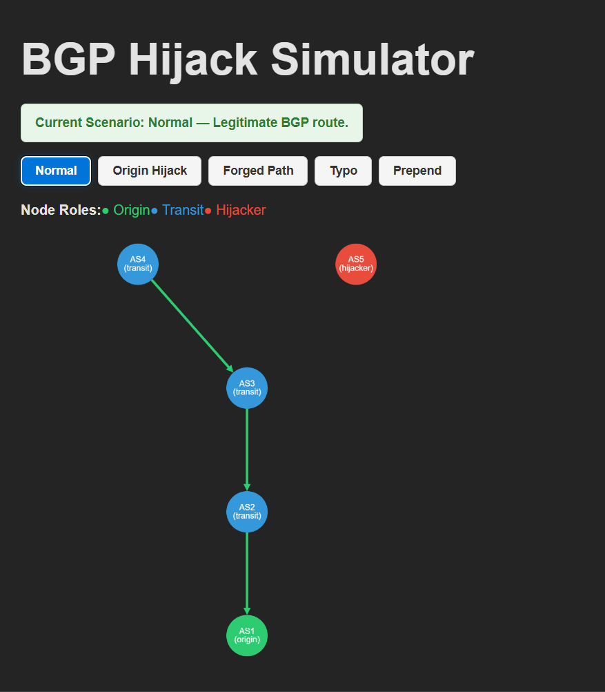
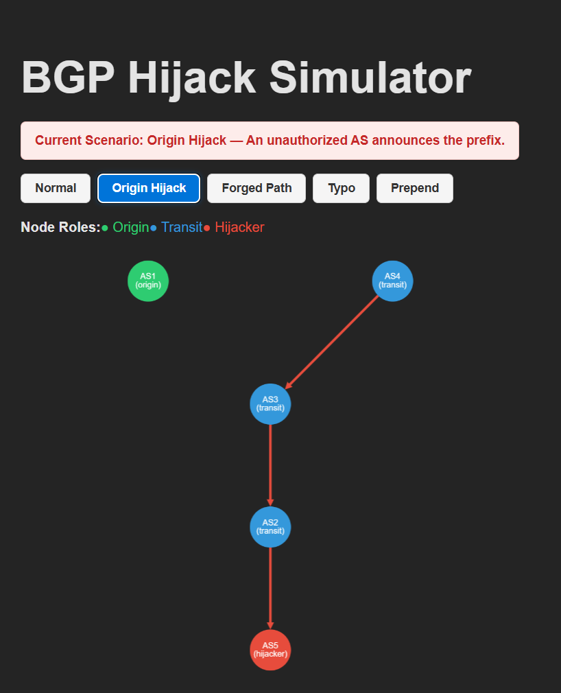
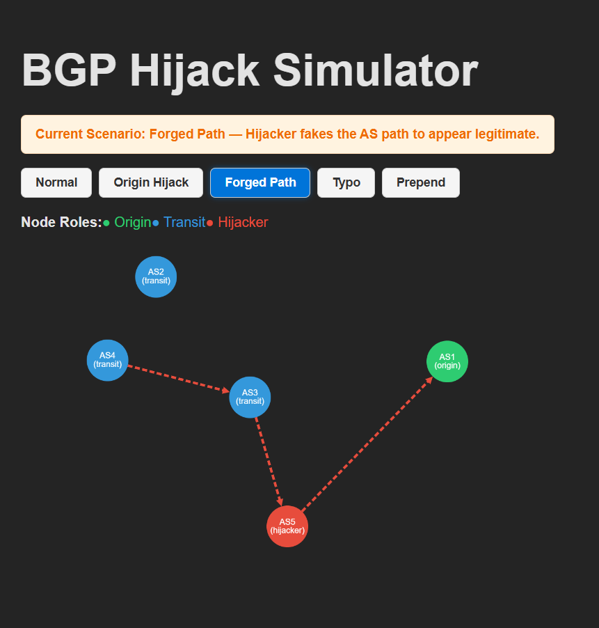
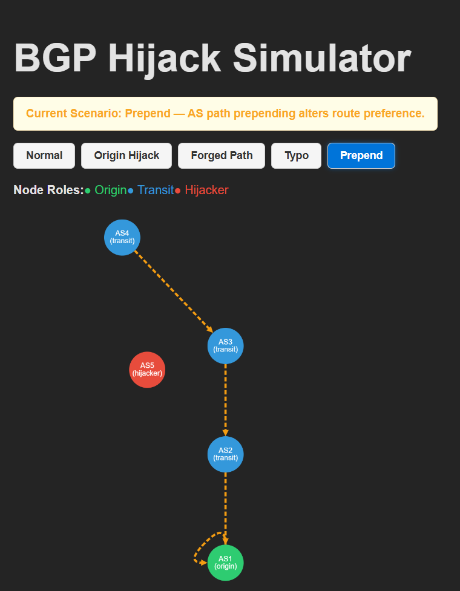
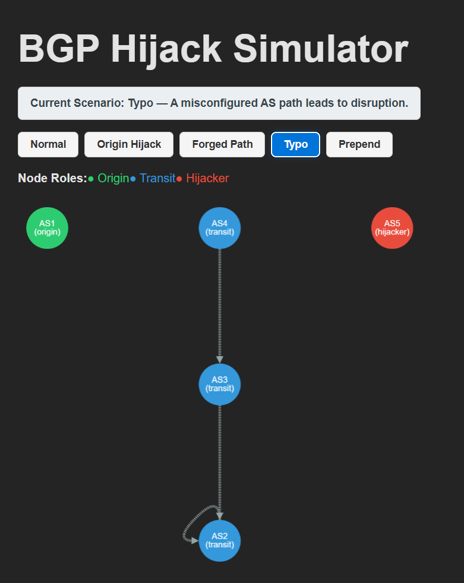

# BGP Hijack Simulator  
An Interactive Learning Platform for Internet Routing Security

Developed during an internship at the National Internet Exchange of India (NIXI), this project simulates real-world BGP (Border Gateway Protocol) hijack scenarios to promote cybersecurity awareness and teach routing vulnerabilities through visualization.

---

## 📘 Overview

BGP (Border Gateway Protocol) governs how data moves between autonomous systems on the Internet. However, due to a lack of built-in security, it is vulnerable to attacks such as route hijacks.  

This simulator enables users to:

- Understand how BGP routing works  
- Visualize different types of BGP hijacks  
- Interactively switch between scenarios  
- Observe the impact of routing anomalies in real-time  

---

## 🎯 Features

- 💻 Browser-based (React + Vite)  
- 🔄 Dynamic scenario switching  
- 🧠 Simulates common BGP hijack techniques  
- 📊 Graph rendering using Cytoscape.js  
- 🎨 Color-coded nodes based on AS roles  
- 📁 Lightweight, frontend-only architecture  

---

## 🖼️ Scenario Demonstrations

| Scenario             | Description                                                    | Preview                             |
|----------------------|----------------------------------------------------------------|-------------------------------------|
| Normal Routing       | Legitimate AS path from origin to destination                  |          |
| Origin Hijack        | A malicious AS falsely claims ownership of a prefix            |             |
| Forged AS Path       | A hijacker inserts the origin AS to make its path look valid   |         |
| AS Path Prepending   | Origin AS artificially inflates its AS path                    |            |
| Typographical Error  | A misconfigured AS path causes route disruption                |               |

---

## 🚀 Getting Started

To run the simulator locally:

```bash
git clone https://github.com/aapJoysakoi/BGP.git
cd BGP
npm install
npm run dev
```
Then open your browser and go to:
http://localhost:5173

---
📁 Project Structure
```bash
BGP/
├── public/
│   ├── bgp_data.json
│   ├── interface.png
│   ├── origin.png
│   ├── forgedpath.png
│   ├── prepend.png
│   └── typo.png
├── src/
│   ├── components/
│   │   ├── Graph.jsx
│   │   └── Controls.jsx
│   ├── App.jsx
│   └── styles.css
├── README.md
├── package.json
```
---

## ⚙️ Tech Stack

- React + Vite (Frontend Framework)  
- Cytoscape.js (Graph Visualization)  
- JSON (Static Routing Scenarios)  
- CSS (Styling)

---

## 📚 Learning Objectives

- Understand the structure and function of BGP  
- Learn how hijack techniques affect routing paths  
- Visually identify route anomalies  
- Strengthen awareness of Internet infrastructure vulnerabilities  

---

## 🔮 Future Enhancements

- CLI-based BGP command simulation  
- Real BGP trace replay using RouteViews or BGPStream  
- Gamified “Challenge Mode” for learners  
- Drag-and-drop scenario builder  
- Containerized BGP lab using FRRouting + Docker  

---

## 👤 Author

**Joysa Kaushik**  
B.Tech-M.Tech (Cyber Security)  
National Forensic Sciences University – Delhi Campus  
Intern, National Internet Exchange of India (NIXI)  

📎 [LinkedIn](https://www.linkedin.com/in/joysakaushik)

---

## 📄 License

This project is released under the MIT License.  
You are welcome to use, share, and adapt this for educational or non-commercial purposes.


